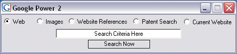



## Google Power 2

### Description

This version of Google Power has automatic top open browser detection for searching individual websites as well as the form staying on top when open.
 
### More Info
 

             |
---                |---
**Submitted On**   |2004-08-21 14:37:16
**By**             |[Thomas Swift](https://github.com/Planet-Source-Code/PSCIndex/blob/master/ByAuthor/thomas-swift.md)
**Level**          |Intermediate
**User Rating**    |5.0 (20 globes from 4 users)
**Compatibility**  |VB 6\.0
**Category**       |[Internet/ HTML](https://github.com/Planet-Source-Code/PSCIndex/blob/master/ByCategory/internet-html__1-34.md)
**World**          |[Visual Basic](https://github.com/Planet-Source-Code/PSCIndex/blob/master/ByWorld/visual-basic.md)
**Archive File**   |[Google\_Pow1784438212004\.zip](https://github.com/Planet-Source-Code/thomas-swift-google-power-2__1-55730/archive/master.zip)

